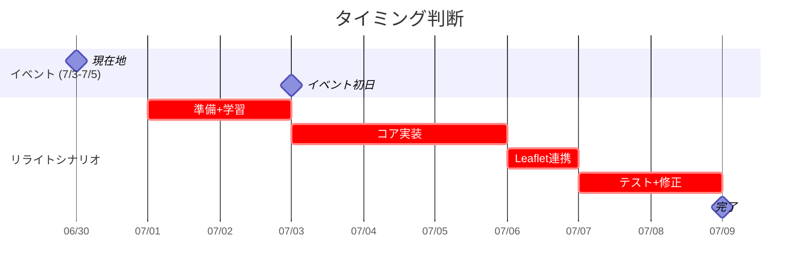

# ADR-002: Elm リライトのコスト分析

> **Status**: 分析 (Analysis)
> **Date**: 2026-06-30
> **Project**: Stray Dog (`yon-straydog/`)
> **Related**: [ADR-001](./001-functional-language-migration.md) — 関数型言語比較

---

## 1. 背景

ADR-001 では Elm を「第二候補」と位置づけ、イベント後にフルリライトを検討するとした。
本 ADR は Elm リライトの**具体的な工数・コスト・リスク**を定量評価する。

---

## 2. 現状コード分析

### 2.1 分類

| 層 | ファイル | 行数 | 割合 | 特性 |
|---|---|---|---|---|
| DOM/画面UI | `index.html` + `src/main.ts` (UI部) | ~400行 | 35% | イベント駆動、DOM更新、アニメーション |
| パズルロジック | `src/puzzle.ts` | 62行 | 5% | **純粋関数** (`Tile`, `PuzzleState`, `selectOrSwap`) |
| 状態管理 | `src/store.ts` | 96行 | 8% | Zustand store、localStorage永続化 |
| GPS/地図 | `src/main.ts` (map+GPS部) | ~120行 | 10% | Leaflet.js、watchPosition、非同期 |
| テキスト謎 | `src/main.ts` (puzzle submit部) | ~50行 | 4% | 入力検証、正誤判定 |
| タイプライター演出 | `src/main.ts` (intro部) | ~120行 | 10% | setInterval、キャラクタ単位表示 |
| デバッグパネル | `src/main.ts` (debug部) | ~100行 | 9% | DOM直接操作、イベントバインド |
| CSS | `src/style.css` | 138行 | 12% | ダークテーマ、アニメーション |
| 画像/設定 | `public/` | — | — | gdog.png、CNAME |

**合計: ~866行のTypeScript + 138行CSS + 145行HTML**

### 2.2 純粋 vs 不純の比率

```
         純粋関数 (puzzle.ts)
         ┌── 62行 ──┐
                    └── 7%
                    
         不純なコード
         ┌──── 804行 ────┐
                          └── 93%
```

Elm へのリライトは「この93%の不純コードをいかに Elm の純粋関数型に変換するか」が本質。

ただし「不純」の内訳:

| 不純の種類 | 行数 | Elm での扱い |
|-----------|------|-------------|
| DOM更新 | ~250行 | Virtual DOM (Elm で最も得意な領域) |
| Leaflet.js 操作 | ~80行 | **Ports 必須** (JSに委譲) |
| GPS/Camera | ~60行 | **Ports 必須** (ブラウザAPI) |
| localStorage | ~20行 | Ports もしくは `Json.Decode` + flags |
| setInterval/タイマー | ~70行 | `Process.sleep` + Sub |
| CSS | 138行 | そのまま（Elm に CSS は無関係） |
| HTML構造 | ~100行 | Elm の `Html` 型で再実装 |

---

## 3. Elm リライト工数見積もり

### 3.1 Port 境界 — JS 残留箇所

Elm はブラウザAPI (DOM操作以外) にアクセスできない。
Stray Dog では以下が Ports 経由になる：

| Port | 方向 | 用途 |
|------|------|------|
| **LeafletMap** | JS→Elm | 地図タイルロード完了通知、マーカークリック |
| | Elm→JS | 地図初期化、センター移動、マーカー追加/削除 |
| **Geolocation** | JS→Elm | 位置情報更新 (watchPosition コールバック) |
| | Elm→JS | watch/stop 開始要求 |
| **Camera** | JS→Elm | 撮影完了、エラー通知 |
| | Elm→JS | カメラ起動要求 |
| **Audio** | JS→Elm | 再生完了通知 |
| | Elm→JS | 再生/停止要求 |
| **localStorage** | JS→Elm | 永続化データ読み込み (flags) |
| | Elm→Elm | 状態保存は `update` 内で完結（Ports 不要） |

**Port ファイル行数見積もり: ~120行**（JS側: Ports 定義 + 初期化）

ただし、GPS と Leaflet の状態（ユーザー位置、マーカー、ズームレベル）は Elm に持ち込めないため、
Elm の `Model` と JS 側の状態が二重管理になるリスクがある。

### 3.2 ドメイン別工数

| ドメイン | TS行数 | Elm工数(時間) | 難易度 | 備考 |
|---------|--------|-------------|--------|------|
| パズルロジック (`puzzle.ts`) | 62 | **0.5h** | 低 | すでに純粋関数。Elm の型にマッピップするだけ |
| 4状態画面遷移 (intro/puzzle/map/complete) | 50 | **1.5h** | 低 | `Model` + `Msg` の設計。TEA に完璧に適合 |
| タイプライター演出 | 120 | **2h** | 中 | `Sub` でタイマー管理。Elm では少し認知負荷が増える |
| テキスト謎モーダル | 50 | **1h** | 低 | フォーム + バリデーション。Elm の得意領域 |
| 4x4パズルUI | 100 | **2h** | 中 | グリッド描画 + タップ処理。Elm の Html で問題なし |
| デバッグパネル | 100 | **1h** | 低 | デバッグ用。シンプルなHtml |
| Leaflet 地図 (Ports) | 80 | **4h** | 高 | **最大のネック**。地図状態の二重管理、マーカー同期 |
| GPS tracking (Ports) | 60 | **2h** | 高 | 位置情報と地図の同期が複雑 |
| ローカルストレージ | 20 | **0.5h** | 低 | `Json.Decode` + flags でOK |
| CSS (そのまま) | 138 | **0h** | — | 変更不要 |
| ビルド設定 (elm.json) | — | **0.5h** | 低 | `elm-review`, `elm-format` 設定 |
| テスト | — | **2h** | 中 | パズルロジックの `elm-test` |
| **合計** | **~866** | **~17h** | | |

### 3.3 累積工数シナリオ

| シナリオ | 工数 | 現実的な日数(集中) | 現実的な日数(並行タスク) |
|---------|------|------------------|----------------------|
| 楽観 (全領域で問題なし) | 12h | 2日 | 4日 |
| **標準 (Ports で軽いハマり)** | **17h** | **3日** | **6日** |
| 悲観 (Leaflet 同期でトラブル) | 25h+ | 5日 | 10日 |

**標準見積もり: 3-6人日**

---

## 4. リスク分析

### 4.1 Leaflet 二重状態問題 (最大リスク)

現在のコードでは Leaflet の `Map`, `CircleMarker`, `Marker[]` を Zustand store に直接保持している。
Elm ではこれらを JS 側に置く必要がある。

**問題**: 地図状態（ズーム、センター、マーカー位置）が変更されたとき、
Elm の Model と JS の Map オブジェクトを同期しなければならない。
同期漏れがあると、GPS が更新されたのにマーカーが動かない、などのバグが発生する。

**緩和策**: 
- Leaflet 操作を Elm の Msg 経由にする（JS 側で副作用として実行）
- 地図状態の `zoom` と `center` だけは Elm Model に持つ（二重管理を許容）
- 緩和しても **4-6時間** の設計・テスト工数が追加される

### 4.2 タイプライター演出の認知負荷

現在のタイプライターは `let` 変数 + `setTimeout` のクロージャで書かれている。
Elm では `Sub` と `Process.sleep` で状態遷移をモデル化する必要がある。

**問題**: 14行のテキストを1文字ずつ表示するには14×18≈250回のメッセージが必要。
Elm の `Sub` + `Cmd` でこれをモデル化すると、`Msg` の種類が増える。

**緩和策**: 
- 1行単位の表示に簡略化（1文字ずつ→行ごと一括）
- あるいは `Task` で逐次処理をチェーン
- 緩和しなくとも実装は可能（認知的コストが増えるだけ）

### 4.3 開発環境のセットアップ

現在:
- TypeScript + Vite: `npm install` のみ
- 型チェック: `npx tsc --noEmit`
- ビルド: `npm run build` (3.7秒)

Elm:
- `elm install` + `elm.json` の設定
- `elm-spa` もしくは `elm-review` の導入
- ビルド: `elm make` (1-2秒) だが Vite 統合が必要
- `elm-vite` プラグインの動作確認

**リスク**: 低。`elm-vite` は stable。ただし初回セットアップに 1-2時間。

### 4.4 チームの Elm 習熟度

ユーザーは Clojure (`world-model`) を使っており関数型に慣れている。
Elm は Haskell 系の純粋関数型で Clojure とは異なるが、学習曲線は緩い。

**リスク**: 低〜中。基本的な TEA パターンを理解するのに半日〜1日。

---

## 5. 評価：やるべきか

### 5.1 得られるもの

| メリット | 定量評価 |
|---------|---------|
| ランタイムエラー 0 | コンパイラが保証。特に状態遷移の網羅性 |
| リファクタリング耐性 | 型変更による影響範囲がコンパイル時に全部分かる |
| テスト容易性 | `elm-test` で純粋関数をテスト (Ports 以外) |
| 状態管理の単一性 | TEA の `Model → update → view` サイクル |
| バンドルサイズ | 現在 50KB gzip → Elm ~30KB gzip に減少 |
| 学習効果 | 関数型への理解が深まる |

### 5.2 失うもの

| デメリット | 定量評価 |
|-----------|---------|
| **6日間の開発時間** | イベント準備に使うべきリソースが消費される |
| Leaflet との相性 | Ports 経由の間接操作。現在の直接呼び出しより劣る |
| npm エコシステム | ほぼ全ライブラリが使えなくなる |
| 段階的導入の余地 | リライトは all-or-nothing。部分的 Elm はできない |
| デバッグのしやすさ | JS の DevTools で Elm の内部状態を見れない |
| **イベントのリスク** | リライト中にバグが出ても修正に時間がかかる |

### 5.3 代替案の比較

| 案 | 工数 | リスク | 純粋関数化の度合い |
|---|------|--------|-------------------|
| **A: 現状維持 + fp-ts 継続** | 0h | 低 | 部分 (30%) |
| **B: Elm リライト** | 17h (3-6日) | 中〜高 | 完全 (100%) |
| **C: Elm リライト (Leaflet以外)** | 12h | 中 | ほぼ完全 (90%) |
| **D: パズル部のみ Elm + 他はJS** | 4h | 低 | 部分 (5%) かつ複雑 |

**案C**: Leaflet 操作は JS のまま、画面 UI + パズルロジックだけ Elm に移すハイブリッド案。
Elm が DOM を管理し、Leaflet は Elm アプリの横で独立起動。
これにより Ports の複雑さを Leaflet に限定できる。

**案D**: `puzzle.ts` を Elm に書き、`ports` で main.ts と通信。
Elm を知る練習にはなるが、アーキテクチャが中途半端。

### 5.4 タイミング判断



**7/3 までに Elm リライトを完了するのは不可能**（残り 3日）。
最短でも **7/9 以降** の完了見込み。

---

## 6. 結論

```diff
+ 勧め:  イベント終了後（7/5以降）に Elm リライトを検討する
- 非勧め: イベント前に Elm リライトを開始する
```

| 判断 | 内容 |
|------|------|
| **7/2 まで** | 現状の TypeScript + fp-ts で仕上げに集中。デプロイ・リハ・告知 |
| **7/5 以降** | Elm リライトの判断。この ADR の工数見積もりをベースに再評価 |
| **リライトするなら** | 案C (Leaflet 以外を Elm) が最適。まず `puzzle.ts` 相当を Elm で書き、画面UIを段階的に移行 |
| **リライトしないなら** | fp-ts の導入を深める。Phase 3 (TEA 風 UI) + Phase 4 (Effect-TS) で Elm 相当の安全性を目指す |

### 6.1 もしリライトする場合の推奨アプローチ

```
Step 1: Elm 環境構築 + puzzle.elm (パズルロジック移植)     — 2h
Step 2: Main.elm (画面UI + テキスト謎 + タイプライター)    — 5h
Step 3: Leaflet Ports (地図 + GPS)                        — 4h
Step 4: デバッグ + テスト (elm-test)                      — 3h
Step 5: デプロイ設定 (surge.sh)                           — 1h
                                       Total: 15h (3-4日)
```

### 6.2 現状維持 + fp-ts 継続のロードマップ (参考)

```
Phase 3 (今週): state machine を TEA パターンで再実装 (JS版TEA)
Phase 4 (翌週): Effect-TS で副作用を分離 (GPS/Camera/Ports をTask化)
Phase 5: Elm に部分移植 (puzzle.ts のみ → elm-test で検証)
```

---

## 7. 付録: Elm コード量の比較見積もり

| 機能 | TypeScript | Elm |
|------|-----------|-----|
| パズルロジック (`selectOrSwap`, `isSolved`) | 62行 | ~30行 |
| 状態定義 (`Model`, `Msg`) | — | ~60行 |
| 画面UI (`view`) | ~250行 | ~200行 |
| GPS/Leaflet Ports | ~140行 | ~120行 (JS側) + ~40行 (Elm側) |
| タイプライター | ~120行 | ~60行 (CSSアニメーション併用) |
| localStorage | ~20行 | ~20行 (flags) |
| CSS | 138行 | 138行 (変わらず) |

Elm の方が**短く**なる見込み（特に UI 部は Elm の Html が JS/DOM操作より簡潔）。
ただし Ports 部は JS が残るため、総コード量は**現状の80〜90%** 程度。

---

*本 ADR は 2026-07-05 に再評価予定（イベント終了後）*
